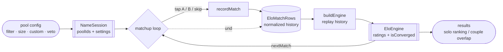
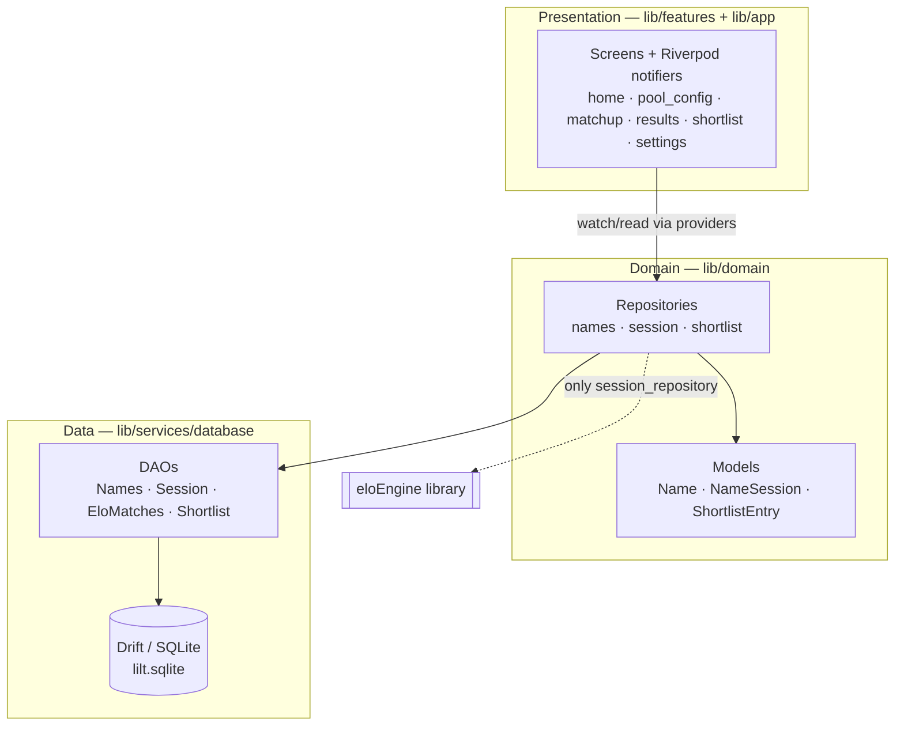
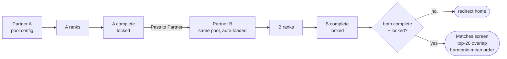
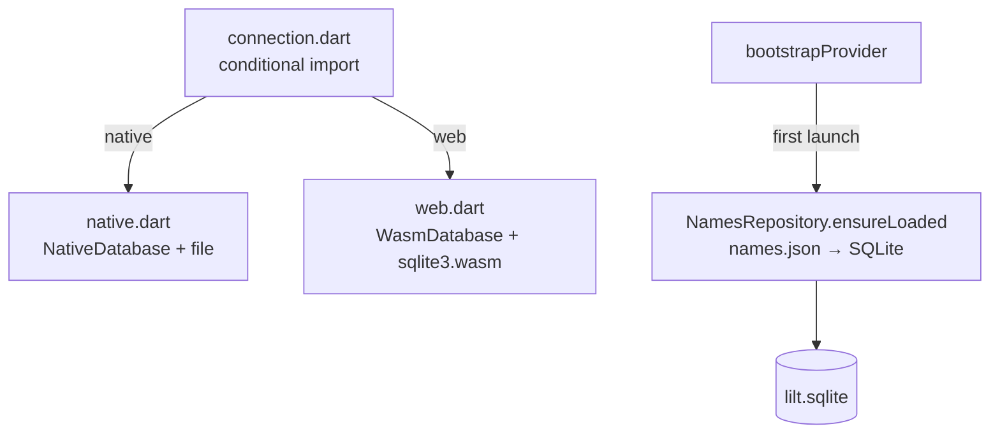

# Architecture Overview

> The one-page mental model of Lilt, then the diagrams that make it concrete. For *why*
> each load-bearing decision was made, see [`docs/adr/`](../adr/). For the domain in
> prose, see [`concepts.md`](../concepts.md).

## What this is, in one paragraph

Lilt is a **Flutter app that ranks baby names by pairwise comparison**. It follows Clean
Architecture: a **presentation** layer (`features/`) of screens and Riverpod notifiers,
a **domain** layer (`repositories/` + `models/`) that owns the logic, and a **data**
layer (`services/database/` — Drift/SQLite) that persists everything on-device. The
ranking math is *not* in this repo — it is delegated to the sibling
[`eloEngine`](../../eloEngine) library, and exactly one file talks to it. Nothing is sent
off the device; the only egress is a user-initiated plain-text share.

## The spine (the single most important picture)

Every feature hangs off one loop: **configure a pool → compare pairs → replay history
into a ranking**. Read this and you understand most of the app.

Two facts to hold onto:

1. **Ratings are never stored — only the comparisons are.** `EloMatchRows` is the source
   of truth; `SessionRepository.buildEngine` reconstructs a fresh `EloEngine` by
   replaying that history on every read. Record and undo are just row insert/delete
   followed by a rebuild. See [ADR-0002](../adr/0002-history-is-source-of-truth.md).
2. **Results are gated, not just computed.** A session is `resultsLocked` by default, and
   the couple-results route refuses to render until *both* partners are complete and
   locked. See [ADR-0004](../adr/0004-peeking-prevention.md).

## The layers (Clean Architecture)

- **The dependency rule holds inward.** Screens depend on repositories; repositories
  depend on DAOs and models; nothing in domain or presentation imports a Drift row type
  outside the repository boundary. See [ADR-0001](../adr/0001-flutter-clean-architecture.md).
- **Exactly one seam to the ranking engine.** Only
  `lib/domain/repositories/session_repository.dart` imports `elo_engine`. Everything
  else sees plain domain types and the `EloEngine` object the repo hands back.

## The couple flow (two people, one device)

Partner B's session is created with **A's exact pool** (`poolIds`, gender, size), so the
two rankings are comparable. The "Matches" screen intersects each partner's top-20 and
orders the overlap by the harmonic mean of the two rank-scores — a name both ranked
highly floats up; a name one loved and the other tolerated sinks. (Note: this is a
screen-local computation, *not* `eloEngine`'s `merge` API.)

## Persistence & platform glue

- **One database, two backends.** `connection/connection.dart` conditionally imports the
  native (`dart:io` + file) or web (`WasmDatabase`, off-main-thread) executor, so the same
  Drift schema runs on Android and in the browser. See
  [ADR-0006](../adr/0006-dual-pwa-apk-target.md).
- **Bootstrap seeds the catalog.** On first launch `bootstrapProvider` loads the bundled
  `assets/data/names.json` (~1,636 names) into SQLite via `insertOrIgnore` — idempotent,
  safe to re-run.

## Module map (where to look)

| Concern | Files |
|---|---|
| **App shell** | `lib/main.dart`, `lib/app/app.dart` (theme, bootstrap splash, 760px desktop clamp), `lib/app/router.dart` |
| **Domain models** | `lib/domain/models/name.dart`, `name_session.dart`, `shortlist_entry.dart` |
| **Repositories (domain logic)** | `lib/domain/repositories/names_repository.dart`, `session_repository.dart` (★ the only `elo_engine` seam), `shortlist_repository.dart` |
| **Data layer** | `lib/services/database/tables.dart`, `database.dart`, `daos/{names,session,elo_matches,shortlist}_dao.dart` (+ `.g.dart`) |
| **Platform DB glue** | `lib/services/database/connection/{connection,native,web}.dart` |
| **Providers** | `lib/core/providers/{database,repository,bootstrap,settings}_provider(s).dart` |
| **Pool setup** | `lib/features/pool_config/pool_config_screen.dart`, `veto_screen.dart` |
| **Matchup** | `lib/features/matchup/matchup_notifier.dart`, `matchup_screen.dart` |
| **Results** | `lib/features/results/solo_results_screen.dart`, `couple_results_screen.dart` |
| **Home / shortlist / detail / settings** | `lib/features/home/`, `shortlist/`, `name_detail/`, `settings/` |
| **Catalog data** | `assets/data/names.json`, `scripts/build_name_dataset.py`, `scripts/curated_names.json` |
| **Ranking engine** | external: [`eloEngine`](../../eloEngine) (path dependency) |

## Invariants that must always hold

These are the rules the whole design depends on. Breaking one is a design regression, not
a feature. (See [VISION.md](../VISION.md) and the ADRs.)

1. **Local-first, no account, no network.** Nothing is sent off-device except an explicit
   share.
2. **History is the source of truth.** Ratings are derived by replay, never persisted.
3. **Peeking prevention.** Locked-by-default; the couple route is guarded.
4. **Clean layering.** One `elo_engine` seam; the UI never touches Drift rows directly.
5. **Reproducibility.** The same match history always yields the same ranking.
